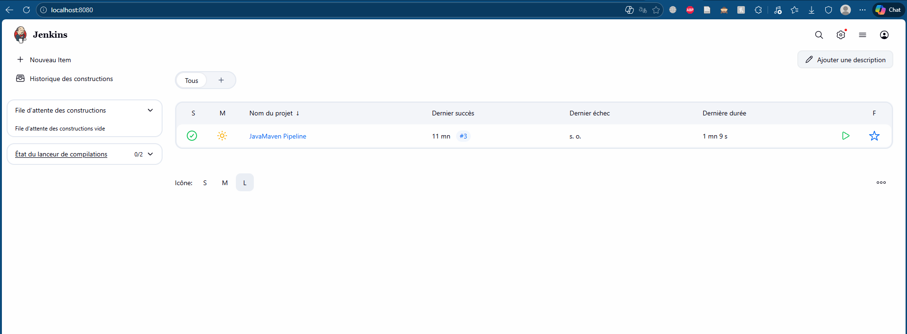
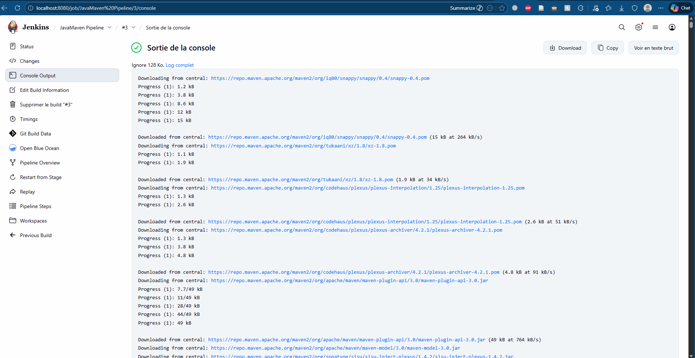

# TP Java Pipeline

## 1. Description
Ce projet implémente un pipeline CI/CD complet avec Jenkins pour une application Java Maven. Il utilise Docker pour la conteneurisation de l'environnement de build et d'exécution, assurant la portabilité et la reproductibilité des tests.

## 2. Architecture
* **Jenkins**: Serveur d'automatisation (CI/CD)
* **Docker**: Conteneurisation des agents de build et de l'environnement Jenkins
* **Maven**: Outil de gestion de dépendances et de build
* **Git**: Gestion de version
* **PowerShell**: Environnement de script sur la machine hôte

## 3. Pipeline Stages
Le pipeline est défini de manière déclarative (Declarative Pipeline) et comprend les étapes suivantes :

### 1. Checkout
Récupération du code source depuis le dépôt GitHub.
* Nettoyage de l'espace de travail.
* Clonage de la branche `main`.

### 2. Build
Compilation du projet avec Maven.
* Utilisation d'un conteneur Docker éphémère avec Maven et Git pré-installés.
* Commande : `mvn clean test package`.

### 3. Test
Exécution des tests unitaires et génération des rapports.
* Génération du rapport avec `mvn surefire-report:report`.

### 4. Run Application
Lancement de l'application pour valider l'artefact généré.
* Exécution du JAR : `java -jar target/maven-0.0.1-SNAPSHOT.jar`.

## 4. Captures d'écran
Les preuves de fonctionnement du pipeline sont disponibles dans le dossier `screenshots/`.

### Jenkins Dashboard


### Configuration du Pipeline


### Build Success (Stage View)


### Console Output


## 5. Configuration et Installation

### Prérequis
* Docker Desktop installé et configuré (avec accès au socket Docker).
* Image Jenkins personnalisée (`myjenkins`).
* Image Agent de build personnalisée (`my-maven-git`).

### Commandes d'Installation (PowerShell)

**1. Construction de l'image de l'agent Maven :**
```powershell
docker build -t my-maven-git:latest .
2. Construction de l'image Jenkins personnalisée (avec plugins et Docker CLI) :

PowerShell

docker build -t myjenkins .
3. Lancement du conteneur Jenkins : Ce conteneur monte le socket Docker de l'hôte pour permettre à Jenkins de lancer d'autres conteneurs (Docker-in-Docker).

PowerShell

docker run -d `
  --name jenkins `
  -p 8080:8080 `
  -p 50000:50000 `
  -v jenkins_home:/var/jenkins_home `
  -v /var/run/docker.sock:/var/run/docker.sock `
  myjenkins
